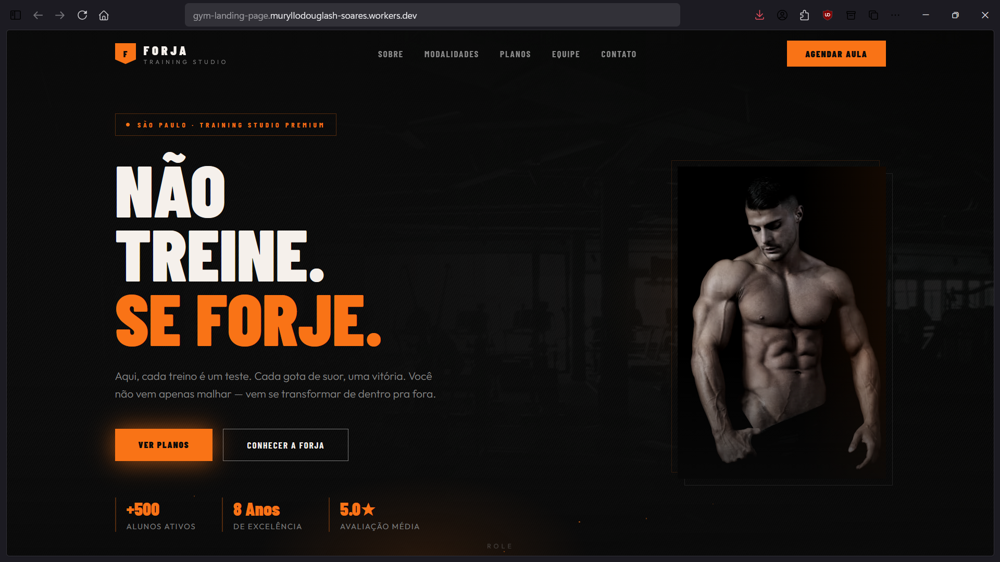
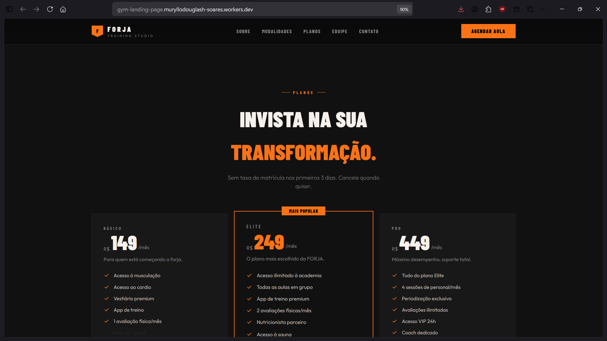
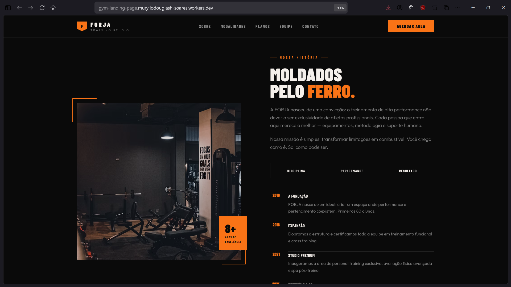
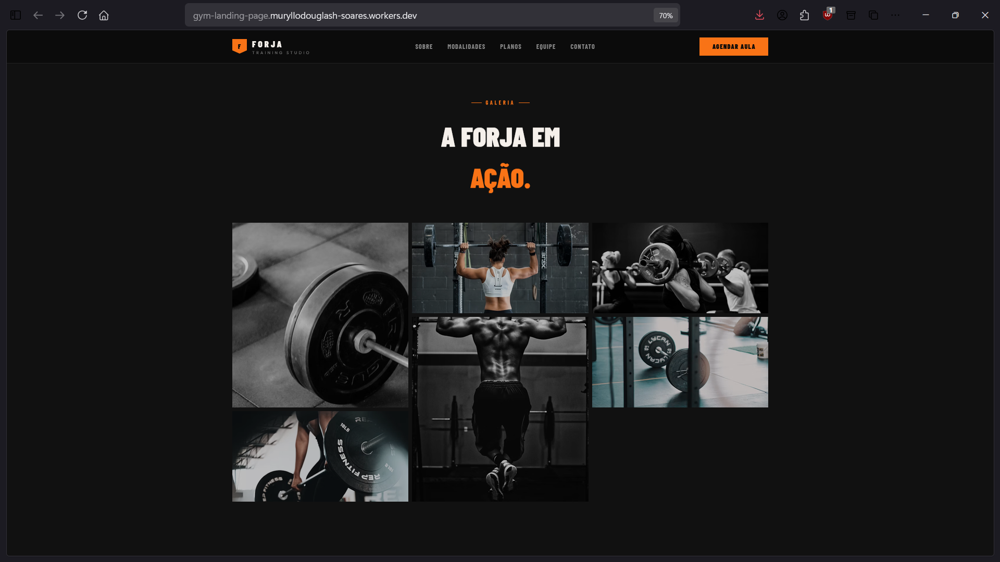
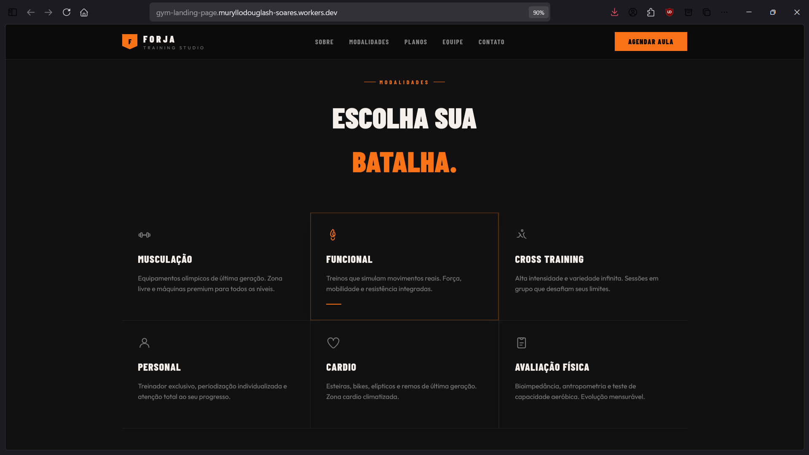
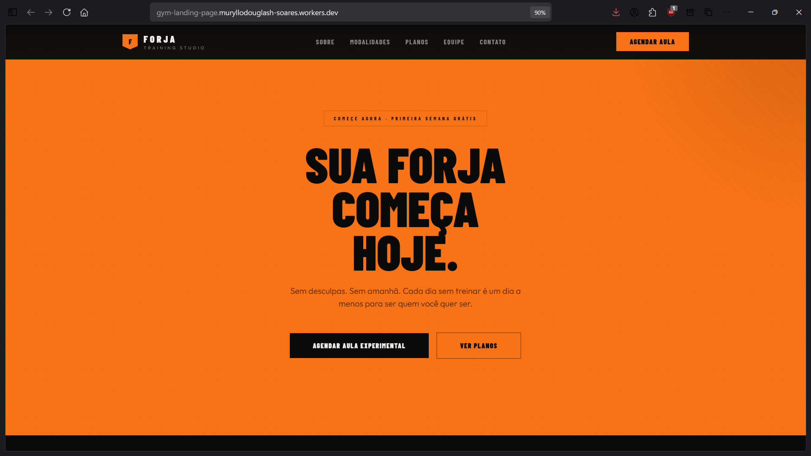
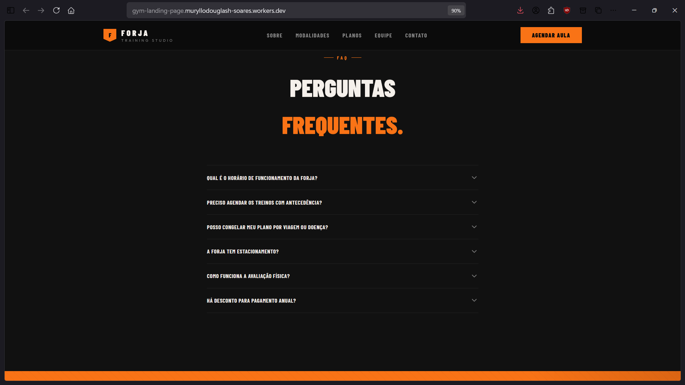
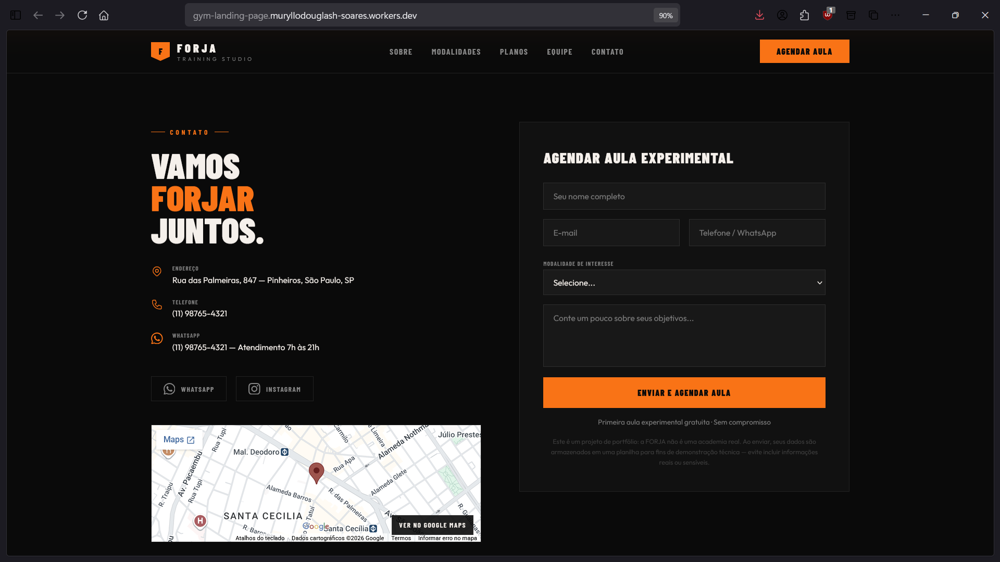

# FORJA Training Studio — Landing Page

> Landing page de alta conversão para um studio de treinamento fictício, com SEO técnico, acessibilidade e formulário de captura de lead integrado a uma automação real.

> ⚠️ **Projeto conceitual.** "FORJA Training Studio" não é uma academia real. Nome, endereço, telefone, equipe e depoimentos são fictícios; as imagens usadas são de banco de imagens (Unsplash), já que não há autorização de uma academia real para uso de fotos próprias. O formulário de contato é funcional (integrado via Make → Google Sheets) apenas para demonstrar o fluxo completo de captura de lead.

## 🌐 Demo

https://gym-landing-page.muryllodouglash-soares.workers.dev/

## 📸 Preview

<table>
  <tr>
    <td></td>
    <td></td>
  </tr>
  <tr>
    <td align="center"><sub>Página principal</sub></td>
    <td align="center"><sub>Planos</sub></td>
  </tr>
  <tr>
    <td></td>
    <td></td>
  </tr>
  <tr>
    <td align="center"><sub>Informações</sub></td>
    <td align="center"><sub>Registro de treinos</sub></td>
  </tr>
  <tr>
    <td></td>
    <td></td>
  </tr>
  <tr>
    <td align="center"><sub>Conteúdo adicional</sub></td>
    <td align="center"><sub>Anúncio</sub></td>
  </tr>
  <tr>
    <td></td>
    <td></td>
  </tr>
  <tr>
    <td align="center"><sub>Perguntas frequentes</sub></td>
    <td align="center"><sub>Formulário de contato</sub></td>
  </tr>
</table>

## Sobre o projeto

O objetivo foi construir uma landing page como a de uma agência entregaria a um cliente real de nicho fitness: identidade visual forte, copywriting persuasivo, formulário validado ponta a ponta, SEO técnico completo e cuidado com performance/acessibilidade — não apenas uma página "bonita".

## Funcionalidades

- [x] Landing page completa (hero, planos, depoimentos, FAQ, contato)
- [x] Formulário de contato com validação dupla: client-side (React Hook Form + Zod) e server-side (`createServerFn`, como defesa em profundidade)
- [x] Campo honeypot anti-bot no formulário
- [x] Integração real do formulário com Make → Google Sheets
- [x] SEO estruturado: JSON-LD (`ExerciseGym` + `FAQPage`), Open Graph, Twitter Card, `canonical`, `sitemap.xml`, `robots.txt`
- [x] Manifest PWA com ícones (incluindo variante `maskable`)
- [x] Otimização de imagem: `srcSet`/`sizes`/`width`/`height` calculados dinamicamente para evitar Cumulative Layout Shift (CLS)

## Tecnologias

### Frontend

- TanStack Start (framework full-stack sobre React, com server functions e SSR)
- React 19 + TypeScript
- Tailwind CSS v4
- shadcn/ui (estilo "new-york") sobre Radix UI
- React Hook Form + Zod (validação client e server)
- TanStack Router / React Query

### Ferramentas

- Bun (gerenciador de pacotes e runtime de desenvolvimento)

## Design e UX

- Paleta customizada (ember/steel/charcoal/ice) e tipografia dupla (Barlow Condensed + Outfit)
- Micro-interações (partículas, glow pulse, reveal on scroll)
- Labels associados a todos os campos, contraste cuidado no tema escuro, navegação por teclado, textos alternativos descritivos em todas as imagens

## Responsividade

Layout responsivo com imagens servidas em tamanhos adequados por viewport via `srcSet`/`sizes`, conforme descrito na seção de performance de imagem.

## SEO

- JSON-LD (`ExerciseGym` + `FAQPage`), meta tags Open Graph e Twitter Card, `canonical`
- `sitemap.xml`, `robots.txt` e manifest PWA com ícones (inclusive `maskable`)

## Como executar

### Pré-requisitos

- Node.js
- Bun

### Instalação

```bash
git clone <URL-do-repositorio>
cd gym-landing-page
bun install
bun run dev
```

Outros scripts disponíveis:

```bash
bun run build      # build de produção
bun run preview    # preview do build
bun run lint         # eslint
bun run format       # prettier
```

### Configuração de ambiente

```
CONTACT_WEBHOOK_URL=
```

> Variável real definida apenas na plataforma de deploy (Cloudflare Pages).

## Estrutura do projeto

```
src/
├── components/
│   ├── forja/          # Seções da landing page (Hero, Planos, Depoimentos, Contato...)
│   └── ui/               # Componentes shadcn/ui reutilizáveis
├── lib/
│   ├── contact-schema.ts    # Schema Zod compartilhado (cliente + servidor)
│   └── contact.server.ts    # Server function que recebe e encaminha o lead
├── routes/               # Rotas (TanStack Router)
└── styles.css              # Design tokens e estilos globais
```

## Decisões técnicas

- **Dados fictícios, mas realistas**: em vez de `lorem ipsum`, todo o conteúdo (planos, FAQ, timeline, equipe) foi escrito como copy real de negócio, para demonstrar capacidade de copywriting e estruturação de informação — não apenas de código.
- **Sem uso indevido de prova social**: os números de avaliação exibidos no JSON-LD refletem um cenário fictício e não devem ser interpretados como dados reais de um negócio existente.
- **Formulário funcional de verdade**: a decisão de conectar a um webhook real (em vez de simular o envio) foi proposital, para demonstrar o fluxo completo de captura de lead — do front-end até a planilha.

## Formulário de contato: formulário → Make → planilha

O formulário de contato (`src/lib/contact.server.ts`) não é apenas front-end — está integrado de ponta a ponta:

1. O usuário preenche e envia o formulário (React Hook Form + Zod cuidam da validação no cliente).
2. O front-end chama `submitContactRequest`, uma server function do TanStack Start — o código roda dentro do Cloudflare Worker, nunca no navegador.
3. A server function primeiro checa o campo honeypot (`empresa`): se estiver preenchido, é tratado como bot e a resposta finge sucesso sem encaminhar nada.
4. Passando por essa checagem, os dados são reenviados via `POST` (JSON) para a URL definida em `CONTACT_WEBHOOK_URL` (secret do Worker) — o cliente nunca acessa essa URL diretamente.
5. Do lado do Make, um Custom Webhook recebe a requisição e grava cada mensagem recebida como uma nova linha em uma planilha do Google Sheets (módulo *Google Sheets → Add a Row*), com os dados do lead (nome, contato, mensagem) e metadados de origem/data.
6. Se `CONTACT_WEBHOOK_URL` não estiver configurada, a submissão é registrada apenas no log do servidor e uma mensagem de erro é retornada ao usuário — evitando perder o lead silenciosamente sem que ninguém perceba a falha de configuração.

Ver a seção [Configuração de ambiente](#configuração-de-ambiente) para configurar o webhook.

## Deploy

Publicado em Cloudflare Pages (conforme URL de demo e variável `CONTACT_WEBHOOK_URL` configurada nessa plataforma).

## Autor

Muryllo Douglas

## Licença

Projeto para fins de portfólio (MIT — ver [`LICENSE`](./LICENSE)). Sinta-se livre para usar como referência.
